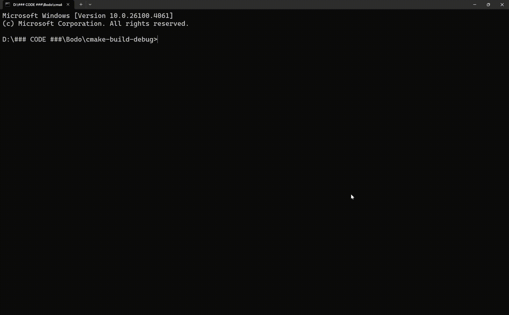
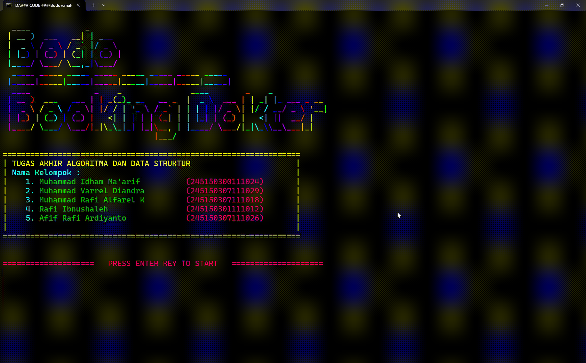
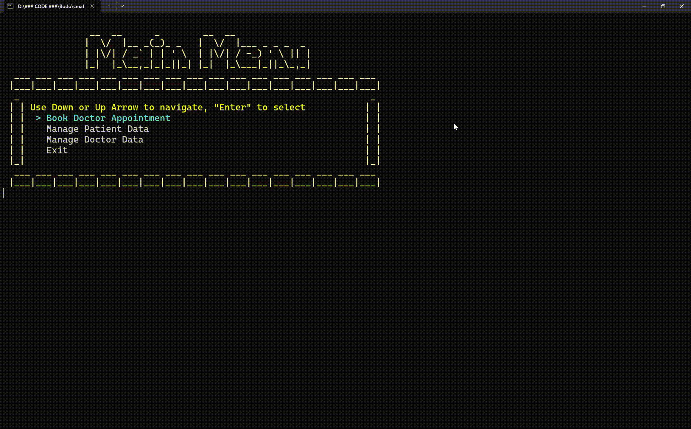

# 🏥 Bodo / Booking Dokter : Hospital Queue & Medical Record Management System


[](#)


**Bodo** or *"Booking Dokter"* is a C++ application that efficiently manages patient queues and medical records using **Queue** and **AVL Tree** data structures. It offers a full suite of features, including CRUD operations, fast search, undo functionality, and optional file saving. Designed with an interactive CLI, Bodo serves as a practical example of applying data structures in real-world scenarios.

**NOTE :**

 ```Bodo can only be used on windows```

---

## 📖 Table of Contents

- [Features](#-features)
- [Installation](#-installation)
- [Usage](#-usage)
- [Project Structure](#-project-structure)
- [Data Structures Used](#-data-structures-used)
- [Demo](#-demo)
- [Contributing](#-contributing)
- [License](#-license)
- [Acknowledgements](#-acknowledgements)

---

## ✨ Features

- **Patient Queue Management**: Efficient handling of patient queues using Queue data structure.
- **Medical Record Management**: Organized storage and retrieval of patient records using AVL Trees.
- **CRUD Operations**: Create, Read, Update, and Delete functionalities for patient data.
- **Fast Search**: Quick retrieval of records through balanced tree structures.
- **Undo Functionality**: Revert recent changes to maintain data integrity.
- **File Saving**: Optional saving of data to files for persistence.
- **Interactive CLI**: User-friendly command-line interface for seamless interaction.

---


## 🛠 Installation

### Prerequisites

- **C++ Compiler**: Ensure you have a C++20 compatible compiler installed.
- **CMake**: Version 3.10 or higher.
- **Ninja**: Version 1.10 or higher.

### Install Prerequisites

1. [**Install Chocolatey**](https://chocolatey.org/install)
2. **Open Windows PowerShell in Administrator Mode**
3. **Install CMake**
   
   ```bash
   choco install cmake
   ```

4. **Install Ninja**

   ```bash
   choco install ninja
   ```

5. **Install C++ Compiler (MinGW) if haven't**

   ```bash
   choco install mingw
   ```

### Steps

1. **Clone the Repository**

   ```bash
   git clone https://github.com/muhammadIdhamMaarif/Bodo.git
   cd Bodo
   ```

2. **Build the Project**

   ```bash
   mkdir build
   cd build
   cmake .. -G Ninja
   ninja
   ```

3. **Run the Application**

   ```bash
   ./Bodo
   ```

*Ensure that CMake and a compatible compiler (like MinGW) are properly installed and configured.*

---

## 🚀 Usage

Upon running the application, you'll be presented with an interactive menu:

.png)
.png)

*Navigate through the menu by using up and down arrow key, then press "Enter" to confirm.*

---

## 📁 Project Structure

```
Bodo/
├── Animation/
├── Core/
│   ├── Abstract/
│   ├── Helper/
│   ├── PeronData/
│   └── Records/
├── Data/
├── DataExample/
├── Interface/
│   ├── CLI/
│   └── GUI/
├── StreamingAssets/
├── main.cpp
├── CMakeLists.txt
├── LICENSE
└── README.md
```

- **Animation/**: Contains the welcoming animation and splash screen.
- **Core/**: Contains the implementation of core data structures.
- **Data/**: Manages the data structure of corresponding classes.
- **DataExample/**: Contains 1 template Data.json, to use copy it to build/SaveData/.
- **Interface/**: Manages the command-line interface, graphical interface and user interactions.
- **StreamingAssets/**: Manages the data save and load, also contains the GIFs and Images.
- **main.cpp**: Entry point of the application.

---

## 🧠 Data Structures Used

### Queue

- **Purpose**: Manages the sequence of patients waiting for services.
- **Operations**: Enqueue, Dequeue, Peek, IsEmpty.

### AVL Tree

- **Purpose**: Stores and manages patient medical records with balanced tree properties.
- **Operations**: Insert, Delete, Search, In-order Traversal.

*Using AVL Trees ensures that search operations remain efficient even as the dataset grows.*

---

## 🎬 Demo







---

## 🤝 Contributing

Contributions are welcome! Here's how you can help:

1. **Fork the Repository**

   Click on the 'Fork' button at the top right of the repository page.

2. **Clone Your Fork**

   ```bash
   git clone https://github.com/yourusername/Bodo.git
   ```

3. **Create a New Branch**

   ```bash
   git checkout -b feature/YourFeatureName
   ```

4. **Make Your Changes**

   Implement your feature or fix.

5. **Commit and Push**

   ```bash
   git add .
   git commit -m "Add YourFeatureName"
   git push origin feature/YourFeatureName
   ```

6. **Submit a Pull Request**

   Navigate to the original repository and open a pull request from your fork.

*Please ensure your code adheres to the project's coding standards and includes appropriate documentation.*

---

## 📄 License

This project is licensed under the [MIT License](LICENSE).

---

## 🙏 Acknowledgements

- [C++ Documentation](https://en.cppreference.com/)
- [GitHub Community](https://github.com/)
- Universitas Brawijaya
- Asisten Praktikum

*Special thanks to all contributors and users who have supported this project.*
